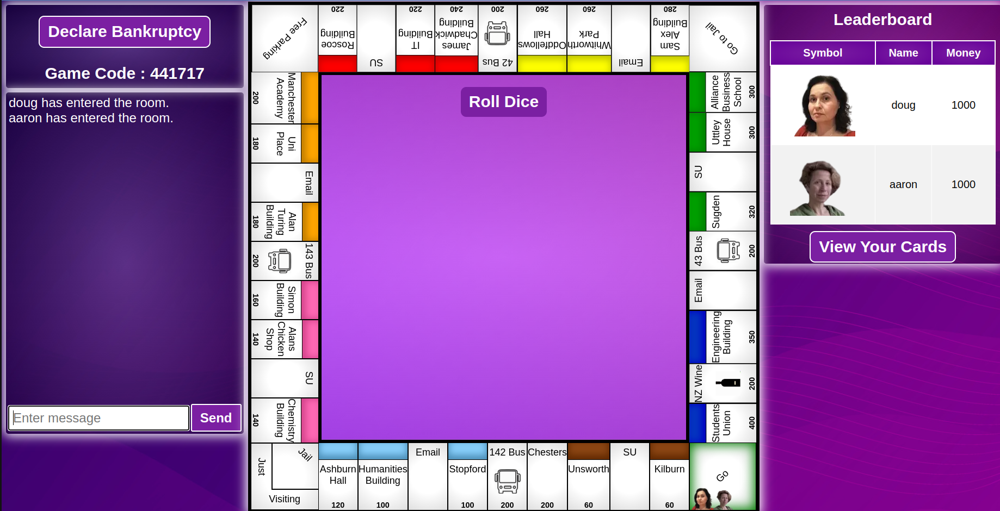

# Uniopoly

## Description

A twist on Monopoly that is:

- University of Manchester themed
- online
- played over multiple devices

Created as a first year team project throught UoM 

## Installation

Install [python](https://www.python.org/downloads/)

Do `pip install -r requirements.txt` to  install the required python modules.

## Usage

To run the project navigate to the directory containing `run.py` enter `python3 run.py` or `python run.py` and you should receive a similar output containing 2 IP addresses. Ctrl click the **second address** or enter it into your browser to play.

Share this address with other players on your local network who wish to play.

## Features

Account system with sign up/ log in page

Menu page with the option to join a game with your friends code

Lobby page with dynamically updating players list and host privelidges

Game page that includes a live chat box allowing you to talk to other players in the game and a rotating board with pop up gameplay messages and buttons.

A window to allow you to manage your cards, to add and remove houses and to mortgage and unmortgage cards.

A winner page decorated with 3d spinning dice.

